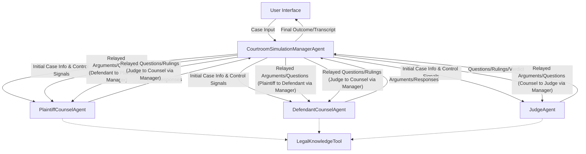

# AI Courtroom Agent Architecture Design Document

## 1. Title

AI Courtroom Agent Architecture

## 2. Overview

The AI Courtroom system is a multi-agent simulation designed to emulate a simplified courtroom proceeding. Its purpose is to allow users to input a case scenario and observe how different AI agents, representing key courtroom roles (a judge, plaintiff's counsel, and defendant's counsel), interact, present arguments, and reach a verdict based on the provided information and (potentially) a knowledge base. This system aims to provide an engaging and educational experience, demonstrating how AI can model complex human interactions and decision-making processes within a structured legal framework.

## 3. Core ADK Principle

This architecture heavily leverages the **Google Agent Development Kit (ADK)** to create and manage a multi-agent system. The ADK's capabilities for defining distinct agent roles, managing inter-agent communication, and orchestrating workflows are central to the AI Courtroom simulation. Each key role in the courtroom will be embodied by a specialized ADK agent.

## 4. Main Orchestrating Agent

*   **Name:** `CourtroomSimulationManagerAgent`
*   **ADK Agent Type:** A **`SequentialWorkflowAgent`** is a suitable ADK agent type. The courtroom proceeding follows a relatively defined sequence (case input, opening statements, arguments, deliberation, verdict). A `SequentialWorkflowAgent` can effectively manage these stages, with specific steps potentially involving conditional logic or loops (e.g., for multiple rounds of arguments if designed). Alternatively, for highly dynamic interactions or complex state management, a custom orchestrator agent built using more foundational ADK components could be considered, but `SequentialWorkflowAgent` provides a strong starting point.
*   **Responsibilities:**
    *   **Managing Simulation Flow:** Orchestrates the entire lifecycle of the courtroom simulation. This includes:
        *   Initial setup and configuration based on user input.
        *   Sequencing the turns for the Plaintiff's Counsel, Defendant's Counsel, and the Judge.
        *   Managing phases like opening statements, presentation of arguments/evidence (abstracted), rebuttals, judge's deliberation, and delivery of the verdict.
    *   **Receiving Initial Case Input:** Accepts the initial case details, facts, and desired outcome from the user. This input will form the basis of the simulation.
    *   **Information Brokerage:** Acts as the central hub for communication:
        *   Passes the initial case information to the relevant child agents (`PlaintiffCounselAgent`, `DefendantCounselAgent`, `JudgeAgent`).
        *   Relays arguments, questions, and rulings between the counsel agents and the `JudgeAgent` as per the defined procedure.
        *   Communicates updates and the final outcome back to the user.
    *   **Enforcing Constraints:** Responsible for managing simulation parameters, such as potential time limits for arguments or turns (this functionality can be detailed further but the manager owns it).
    *   **Presenting Outcome:** Compiles and presents the final verdict and potentially a summary or transcript of the key arguments and decisions to the user.

## 5. Child Agents (Specialized Roles)

### 5.1. Judge Agent

*   **Name:** `JudgeAgent`
*   **ADK Agent Type:** **`LlmAgent`**. This agent needs to understand legal arguments, ask clarifying questions, maintain neutrality, deliberate, and formulate a verdict based on the "facts" and "arguments" presented. Its behavior will be heavily guided by its system prompt.
*   **Core Role & Purpose:**
    *   Presides over the simulated courtroom proceeding.
    *   Maintains order and ensures adherence to the simulation's procedural rules (as directed by the `CourtroomSimulationManagerAgent`).
    *   Listens to arguments from both plaintiff and defendant counsel.
    *   May ask clarifying questions to either counsel (channeled through the `CourtroomSimulationManagerAgent`).
    *   "Deliberates" on the presented arguments and case facts (simulated by LLM reasoning).
    *   Delivers a final verdict and potentially a brief explanation or reasoning.
*   **Key Interactions:**
    *   `CourtroomSimulationManagerAgent`: Receives case information, instructions on whose turn it is, and arguments from counsel. Sends questions, rulings, and the final verdict back to the manager.
    *   `LegalKnowledgeTool` (Optional): Could be granted access to this tool to "research" or "verify" legal points mentioned by counsel, adding depth to its deliberation.

### 5.2. Plaintiff's Counsel Agent

*   **Name:** `PlaintiffCounselAgent`
*   **ADK Agent Type:** **`LlmAgent`**. This agent needs to construct persuasive arguments, present a case, and respond to opposing counsel and judicial queries from the perspective of the plaintiff.
*   **Core Role & Purpose:**
    *   Represents the plaintiff's side in the simulation.
    *   Receives initial case facts relevant to the plaintiff from the `CourtroomSimulationManagerAgent`.
    *   Formulates and presents opening statements, arguments, and (abstracted) evidence supporting the plaintiff's claim.
    *   May offer rebuttals to the defendant's arguments.
    *   Responds to questions from the `JudgeAgent`.
*   **Key Interactions:**
    *   `CourtroomSimulationManagerAgent`: Receives case information and instructions. Sends its arguments, statements, and responses to the manager.
    *   `DefendantCounselAgent` (Indirectly): Arguments are relayed via the `CourtroomSimulationManagerAgent`.
    *   `JudgeAgent` (Indirectly): Arguments and responses to questions are relayed via the `CourtroomSimulationManagerAgent`.
    *   `LegalKnowledgeTool` (Optional): Could be granted access to this tool to find legal precedents or statutes that support the plaintiff's case.

### 5.3. Defendant's Counsel Agent

*   **Name:** `DefendantCounselAgent`
*   **ADK Agent Type:** **`LlmAgent`**. Similar to the plaintiff's counsel, this agent must generate arguments, but from the defendant's perspective, focusing on defenses and counter-arguments.
*   **Core Role & Purpose:**
    *   Represents the defendant's side in the simulation.
    *   Receives initial case facts relevant to the defendant from the `CourtroomSimulationManagerAgent`.
    *   Formulates and presents opening statements, arguments, defenses, and (abstracted) evidence countering the plaintiff's claims.
    *   May offer rebuttals to the plaintiff's arguments.
    *   Responds to questions from the `JudgeAgent`.
*   **Key Interactions:**
    *   `CourtroomSimulationManagerAgent`: Receives case information and instructions. Sends its arguments, statements, and responses to the manager.
    *   `PlaintiffCounselAgent` (Indirectly): Arguments are relayed via the `CourtroomSimulationManagerAgent`.
    *   `JudgeAgent` (Indirectly): Arguments and responses to questions are relayed via the `CourtroomSimulationManagerAgent`.
    *   `LegalKnowledgeTool` (Optional): Could be granted access to this tool to find legal precedents or statutes that support the defendant's case or refute the plaintiff's claims.

## 6. High-Level Interaction Diagram (Textual Description)

**Explanation of Diagram:**

*   **Solid Lines:** Represent primary data flow and control signals.
*   **User to Manager:** The user initiates the simulation by providing case input to the `CourtroomSimulationManagerAgent`.
*   **Manager to Child Agents:** The Manager distributes initial case information and controls the turn-based flow of the simulation, sending signals to the `JudgeAgent`, `PlaintiffCounselAgent`, and `DefendantCounselAgent`.
*   **Child Agents to Manager:** Each child agent sends its contributions (arguments, questions, rulings, verdict) back to the Manager.
*   **Manager as Intermediary:** The Manager is responsible for relaying communications between the child agents. For example, when the `PlaintiffCounselAgent` presents an argument, it goes to the Manager, who then forwards it to the `DefendantCounselAgent` and the `JudgeAgent`.
*   **Manager to User:** The Manager presents the final outcome, including the verdict and potentially a summary of the proceedings, back to the user.
*   **Dotted Lines (Optional):** Indicate potential direct access for child agents to the `LegalKnowledgeTool` for research, enhancing their argumentative or decision-making capabilities.

## 7. Modularity and Scalability

This multi-agent architecture is inherently modular and designed for scalability:

*   **Clear Role Separation:** Each agent has a well-defined role and set of responsibilities. This makes it easier to develop, test, and refine individual agent behaviors independently.
*   **Adding New Roles:** The system can be extended by adding new types of agents with minimal disruption to the existing architecture. For example:
    *   **`WitnessAgent(s)`:** Could be introduced to provide "testimony" (pre-scripted or LLM-generated based on case facts), which counsel agents could then "examine" or "cross-examine."
    *   **`ExpertWitnessAgent(s)`:** Specialized agents that could provide opinions on specific technical aspects of a case (e.g., a medical expert agent, a financial expert agent).
    *   **`JuryAgent`:** A more complex agent (or a group of agents) could be added to simulate jury deliberation if the system were to model jury trials.
*   **Enhancing Existing Roles:** The capabilities of existing agents can be enhanced. For instance, counsel agents could be given more sophisticated tools for argument analysis or strategy formation. The `JudgeAgent` could have more complex deliberation logic.
*   **Tool Integration:** More specialized tools (beyond the `LegalKnowledgeTool`) could be integrated and made accessible to specific agents as needed.
*   **Workflow Modification:** While currently envisioned as largely sequential, the `CourtroomSimulationManagerAgent`'s workflow can be modified to accommodate more complex procedural rules or interaction patterns as the simulation's sophistication grows.

This modular design ensures that the AI Courtroom can evolve over time, increasing in complexity and realism by adding or refining individual components without requiring a complete overhaul of the system.
